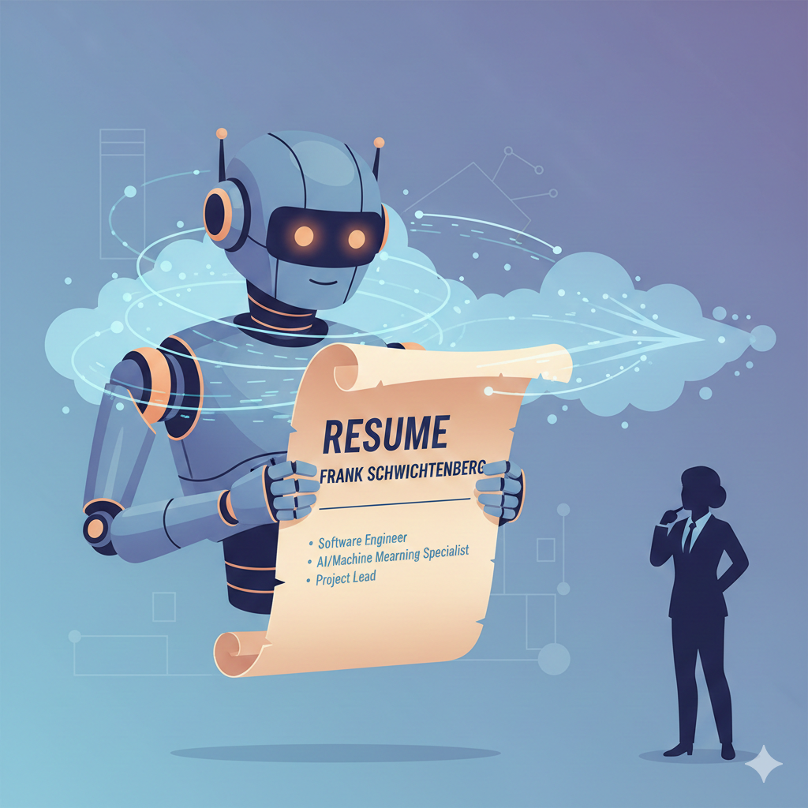

# AI Resume Agent

**Turn a static resume into an AI-powered conversation.**

Recruiters scan PDFs for keywords. They miss context — how skills were applied, what challenges were overcome, whether the candidate actually fits the role. This project replaces that with an AI agent that can answer questions, assess job fit honestly, and surface relevant experience through semantic search.

https://github.com/user-attachments/assets/demo.mp4

> *A recruiter asks about AI experience, tests job fit with a real job description, and explores leadership style — all without scheduling a call.*

## Live Demo

Try it with a fictional candidate: **[jane-doe-ai-resume.schwichtenberg.us](https://jane-doe-ai-resume.schwichtenberg.us/)**

Suggested things to try:
- Ask about specific skills or experience
- Paste a real job description into the Fit Assessment tab
- Ask a question the resume can't answer (watch the honest response)

## Who Is This For?

| You are a... | What you get |
| ------------ | ------------ |
| **Resume Owner** | Deploy your resume as an always-available AI agent. Visitors get thoughtful answers about your experience without you being in the room. |
| **Recruiter / Hiring Manager** | Instant, detailed answers about a candidate. Ask about specific skills, experience depth, or job fit. No more scanning PDFs or scheduling screening calls. |
| **Engineer / Architect** | A reference implementation of a production RAG system: Rust gRPC service, Python FastAPI, React frontend, semantic search with cross-encoder re-ranking, container deployment. |

## What It Does

**AI Chat** — Ask anything about the candidate's background. The agent retrieves relevant resume context via hybrid search (BM25 + vector embeddings + cross-encoder re-ranking) and generates grounded, citation-backed answers. It won't hallucinate or make things up.

**Fit Assessment** — Paste a real job description and get an honest analysis: key matches, gaps, and a recommendation. Pre-analyzed examples show strong and weak fit scenarios so you know what calibrated output looks like.

**Experience Cards** — Structured view of roles, projects, and skills loaded dynamically from a single portable data file.



## How It Works

```
master_resume.md        Python ingest         .mv2 file          Rust gRPC        Python API       React SPA
(your resume)     ───►  (chunk + embed)  ───► (vector DB)   ───► (search)    ───►  (LLM + SSE) ───► (chat UI)
                                                                  <5ms              streaming        responsive
```

All content comes from a single Markdown file with YAML frontmatter. No hardcoded data in the frontend — everything flows through the API from the `.mv2` vector database.

### Architecture

Three containers behind a reverse proxy:

| Service | Stack | Role |
| ------- | ----- | ---- |
| **memvid-service** | Rust, Tonic gRPC, memvid-core | Semantic search, state lookup, Ask mode with re-ranking |
| **api-service** | Python, FastAPI, OpenRouter | LLM orchestration, fit assessment, SSE streaming |
| **frontend** | React, TypeScript, Tailwind, shadcn/ui | Chat UI, experience cards, fit assessment |

Key technical decisions:
- **Hybrid search**: BM25 lexical + vector semantic + cross-encoder re-ranking (Reciprocal Rank Fusion)
- **Honest by design**: System prompts enforce factual grounding; guardrails block prompt injection
- **Single-file portability**: One `.mv2` file contains all embeddings, metadata, and profile data
- **Read-only containers**: All services run rootless with read-only filesystems

## Quick Start

```bash
# 1. Create your resume
cp data/example_resume.md data/master_resume.md
# Edit with your information (see docs/MASTER_DOCUMENT_SCHEMA.md for format)

# 2. Ingest into vector database
cd ingest && uv run python ingest.py --verify

# 3. Configure secrets
cp deployment/.env.example deployment/.env
# Add your OPENROUTER_API_KEY

# 4. Deploy
cd deployment && podman-compose up -d
```

See [docs/SETUP.md](docs/SETUP.md) for complete instructions including multi-arch container builds.

## Documentation

| Document | Description |
| -------- | ----------- |
| [Setup](docs/SETUP.md) | Installation, building, deployment |
| [Architecture](docs/ARCHITECTURE.md) | System design, data flow, network topology |
| [PRD](docs/PRD.md) | Product requirements, success metrics |
| [Development](docs/DEVELOPMENT.md) | Contributing guide, workflows |
| [Master Document Schema](docs/MASTER_DOCUMENT_SCHEMA.md) | Resume markdown format |
| [Agentic Flow](docs/AGENTIC_FLOW.md) | LLM orchestration and prompt design |
| [Security](docs/SECURITY.md) | Security hardening, vulnerability management |
| [Test Coverage](docs/TEST_COVERAGE.md) | Test strategy and coverage reports |
| [TODO](docs/TODO.md) | Roadmap and task breakdown |

## About This Project

This is a reference project by [Frank Schwichtenberg](https://github.com/schwichtgit) — built to solve a real problem (making resumes interactive) while demonstrating production engineering practices across the stack:

- **Systems design**: Rust + Python hybrid architecture with gRPC boundaries
- **Search & retrieval**: Semantic search, BM25, cross-encoder re-ranking, metadata filtering
- **LLM engineering**: RAG pipeline, prompt design, guardrails, streaming responses
- **Infrastructure**: Multi-arch containers, rootless deployment, read-only filesystems
- **Security**: Prompt injection defense, rate limiting, input validation, container hardening

## License

PolyForm Noncommercial License 1.0.0 — See [LICENSE](LICENSE) file.
