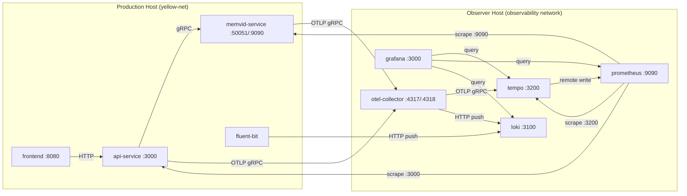
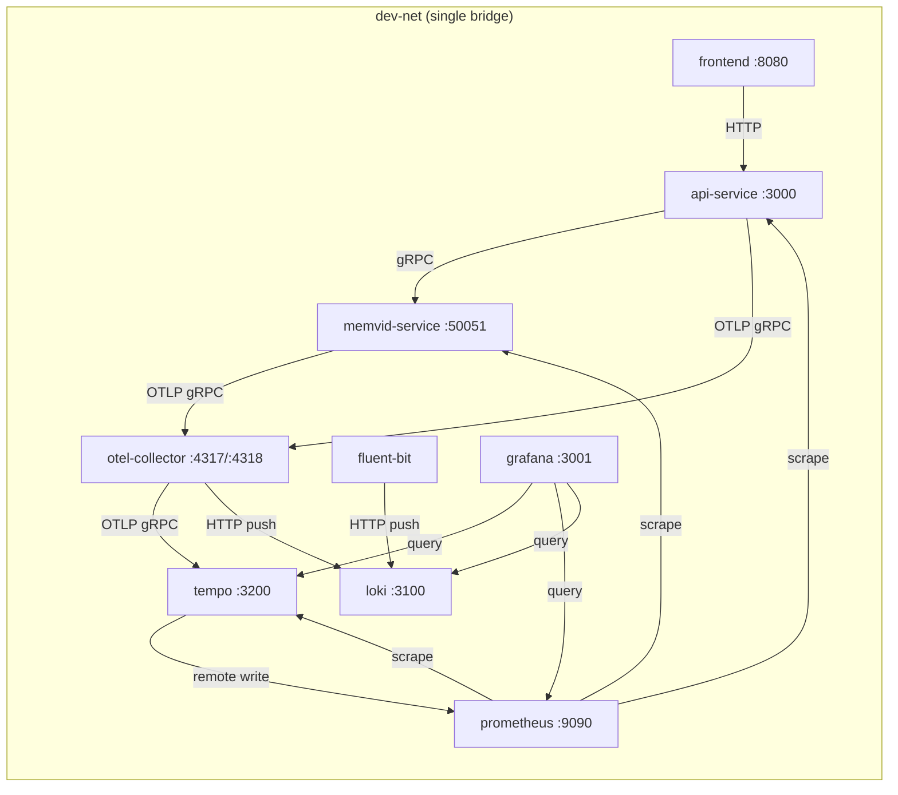

# Observability

Comprehensive guide to the ai-resume distributed tracing, metrics, and logging
infrastructure. Written for operators and developers with zero assumed prior
knowledge of observability tooling.

---

## Table of Contents

1. [Observability Concepts](#1-observability-concepts)
2. [Architecture](#2-architecture)
3. [Instrumentation Guide](#3-instrumentation-guide)
4. [Dashboard Reference](#4-dashboard-reference)
5. [Runbooks](#5-runbooks)
6. [Quick Start](#6-quick-start)
7. [Configuration Reference](#7-configuration-reference)
8. [Glossary](#8-glossary)

---

## 1. Observability Concepts

### Why Observability Matters Here

ai-resume is a polyglot microservices system: a TypeScript/React frontend, a
Python/FastAPI backend, and a Rust gRPC service. When a user sends a chat
message, the request crosses three language runtimes, two network protocols
(HTTP and gRPC), and an external LLM API. Without observability, a slow
response could originate anywhere in that chain and you would have no way to
narrow it down.

**Observability** is the ability to understand the internal state of a system by
examining the signals it produces. Those signals fall into three categories,
called the **three pillars**.

### Pillar 1: Traces

A **trace** is a record of a single request as it moves through multiple
services. It is identified by a **trace ID**, a 32-hex-character string
(example: `4bf92f3577b34da6a3ce929d0e0e4736`) that stays the same across every
service boundary.

A trace is composed of **spans**. A span is a single timed operation, such as
"search the memvid index" or "call the OpenRouter LLM." Each span records:

- Its name (e.g., `memvid.search`)
- Start and end timestamps (duration)
- Key-value **attributes** (e.g., `search.chunks_retrieved=5`,
  `llm.tokens_used=342`)
- A **span ID** (16 hex chars) uniquely identifying this span within the trace
- A **parent span ID** linking it to the span that initiated it

Spans form a tree. In ai-resume, a typical chat request produces this hierarchy:

```text
browser: chat.send_message (frontend)
  POST /api/v1/chat (auto-instrumented by FastAPIInstrumentor)
    guardrail.check_input (Python manual span)
    memvid.search (Python manual span)
      search (Rust #[instrument] span, child via traceparent propagation)
    llm.openrouter_call (Python manual span)
    guardrail.check_output (Python manual span)
    session.store (Python manual span)
```

The **waterfall view** in Grafana displays this tree visually with bars whose
width represents duration. It immediately shows which span consumed the most
time.

### Pillar 2: Metrics

A **metric** is a numeric measurement aggregated over time. Metrics are cheap to
store and query, making them ideal for dashboards and alerting. Three metric
types appear in this project:

- **Counter**: A value that only goes up. Example: `llm_requests_total` counts
  every LLM call. You apply a `rate()` function to see requests per second.
- **Histogram**: Records the distribution of values in configurable buckets.
  Example: `llm_latency_seconds` records how long each LLM call takes, with
  buckets at 0.5s, 1s, 2s, 5s, 10s, 30s, 60s, 120s. From a histogram you can
  compute percentiles (p50, p95, p99).
- **Gauge**: A value that goes up and down. Example: `llm_active_requests`
  tracks how many LLM calls are in-flight right now.

This project uses **RED metrics** (Rate, Errors, Duration) as the primary
health indicators:

- **Rate**: How many requests per second each endpoint handles.
- **Errors**: What fraction of those requests fail (4xx or 5xx).
- **Duration**: How long requests take (measured at p50, p95, p99).

### Pillar 3: Logs

**Structured logs** are JSON-formatted log entries emitted by each service. The
Python API service uses **structlog** to produce log lines that include
machine-readable fields:

```json
{
  "event": "llm_response",
  "trace_id": "4bf92f3577b34da6a3ce929d0e0e4736",
  "span_id": "00f067aa0ba902b7",
  "model": "nvidia/nemotron-nano-9b-v2:free",
  "tokens_total": 342,
  "latency_ms": 2150,
  "level": "info",
  "timestamp": "2026-03-01T14:23:01.456Z"
}
```

Container logs from all services are captured by **Fluent Bit** (a lightweight
log shipper) and forwarded to **Loki** (a log aggregation backend).

### How the Three Pillars Correlate

The three signals are linked by the **trace_id** field:

1. A trace in Tempo has a trace ID.
2. Structured logs in Loki include the same trace ID.
3. Tempo's **metrics generator** derives RED metrics from traces and writes them
   to Prometheus as `traces_spanmetrics_*` metrics.
4. Grafana cross-links all three: click a trace to jump to its logs, view
   metrics derived from the same spans.

This means you can start from any pillar and pivot to the others. See a latency
spike in metrics, find the slow traces in Tempo, then read the detailed logs in
Loki for the exact error message.

---

## 2. Architecture

### Production Topology (Split-Host)

In production, the application services and the observability stack run on
separate hosts to isolate monitoring overhead from request-serving resources.

```text
[OpenWRT Production Host]                [LAN Observer Host]
  ai-resume-frontend  (8080)               otel-collector  (4317/4318)
  ai-resume-api       (3000)               tempo           (3200)
  ai-resume-memvid    (50051, 9090)         prometheus      (9090)
  fluent-bit          (sidecar)             loki            (3100)
                                            grafana         (3000)
     --- OTLP gRPC (4317) ---------->
     --- HTTP logs  (3100) ---------->
     <-- Prometheus scrape (3000, 9090) --
```

**Network**: Application services connect to a pre-created `yellow-net` bridge
network with static IPs (`192.168.100.10-12`). Fluent Bit also joins
`yellow-net` to reach Loki on the observer host. Prometheus on the observer
host scrapes the application host via `host.containers.internal` (or the LAN
IP).

**Data flows**:

- **Traces**: Application services send OTLP gRPC to the collector on the
  observer host. The collector forwards traces to Tempo.
- **Logs (OTLP)**: Application services can also send logs via OTLP to the
  collector, which exports to Loki.
- **Logs (container)**: Fluent Bit tails container log files from the podman
  log directory and pushes them to Loki via HTTP.
- **Metrics**: Prometheus scrapes `/metrics` endpoints on the API service
  (port 3000) and memvid service (port 9090) every 15 seconds. It also scrapes
  Tempo (port 3200) for internally generated span metrics.

### Production Topology (Mermaid)



### Development Topology (Single-Host)

In development, all 9 services share a single `dev-net` bridge network using
container DNS (no static IPs). Grafana is remapped to port 3001 to avoid
conflict with the API service on port 3000.

```text
[Development Host - dev-net]
  ai-resume-frontend   (8080)
  ai-resume-api        (3000)
  ai-resume-memvid     (50051)
  fluent-bit           (sidecar)
  otel-collector       (4317, 4318)
  grafana              (3001 -> internal 3000)
  tempo                (3200)
  prometheus           (9090)
  loki                 (3100)
```

### Development Topology (Mermaid)



### Component Table

| Component          | Image                                  | Exposed Ports                | Config File                                    | Role                                                      |
| ------------------ | -------------------------------------- | ---------------------------- | ---------------------------------------------- | --------------------------------------------------------- |
| ai-resume-frontend | `ai-resume-frontend`                   | 8080                         | `frontend/nginx-default.conf`                  | OpenResty SPA server, proxies API, injects OTel endpoint  |
| ai-resume-api      | `ai-resume-api`                        | 3000                         | `api-service/ai_resume_api/main.py`            | FastAPI backend, LLM orchestration, Prometheus `/metrics` |
| ai-resume-memvid   | `ai-resume-memvid`                     | 50051 (gRPC), 9090 (metrics) | `memvid-service/src/main.rs`                   | Rust semantic search over .mv2 files                      |
| fluent-bit         | `cr.fluentbit.io/fluent/fluent-bit`    | (none)                       | `deployment/observability/fluent-bit.conf`     | Tails container logs, ships to Loki                       |
| otel-collector     | `otel/opentelemetry-collector-contrib` | 4317 (gRPC), 4318 (HTTP)     | `deployment/observability/otel-collector.yaml` | Receives OTLP, exports to Tempo and Loki                  |
| tempo              | `grafana/tempo`                        | 3200, 4317 (internal)        | `deployment/observability/tempo.yaml`          | Trace storage, TraceQL queries, metrics generation        |
| prometheus         | `prom/prometheus`                      | 9090                         | `deployment/observability/prometheus.yml`      | Scrapes metrics, stores time series                       |
| loki               | `grafana/loki`                         | 3100                         | `deployment/observability/loki.yaml`           | Log aggregation, LogQL queries                            |
| grafana            | `grafana/grafana`                      | 3000 (prod) / 3001 (dev)     | `deployment/observability/provisioning/`       | Dashboards, data source exploration                       |

### Production vs Development Differences

| Aspect                      | Production                                                                  | Development                                            |
| --------------------------- | --------------------------------------------------------------------------- | ------------------------------------------------------ |
| Network                     | `yellow-net` (static IPs) + `podman` bridge                                 | `dev-net` (container DNS)                              |
| Grafana port                | 3000                                                                        | 3001 (remapped)                                        |
| Prometheus config           | `deployment/observability/prometheus.yml` (uses `host.containers.internal`) | `deployment/prometheus.dev.yml` (uses container names) |
| Service discovery           | Static IP targets                                                           | DNS-based container names                              |
| OTEL_EXPORTER_OTLP_ENDPOINT | Points to observer host                                                     | `http://otel-collector:4317`                           |
| LOKI_HOST (fluent-bit)      | `observer` (observer hostname)                                              | `loki` (container name)                                |

### macOS Podman Notes

On macOS, podman runs containers inside a Linux VM. The `PODMAN_LOG_ROOT`
environment variable must point to the container log directory inside the VM.
Discover it with:

```bash
podman info --format '{{.Store.GraphRoot}}' | sed 's|/libpod/.*||'
```

On Linux hosts, the default `/var/log/containers` usually works. Override it
via the `PODMAN_LOG_ROOT` variable in your `.env` file.

---

## 3. Instrumentation Guide

### Python (api-service)

#### Automatic Instrumentation

`FastAPIInstrumentor` from the `opentelemetry-instrumentation-fastapi` package
automatically creates a span for every HTTP request. These spans record the
HTTP method, route, status code, and duration. The instrumentation is
initialized in `api-service/ai_resume_api/otel.py`:

```python
from opentelemetry.instrumentation.fastapi import FastAPIInstrumentor
FastAPIInstrumentor.instrument_app(app)
```

This produces spans with names like `POST /api/v1/chat` and
`GET /api/v1/profile`.

#### Manual Spans

The following spans are created manually in the request handlers to provide
fine-grained timing for each processing stage:

| Span Name                | Location                     | Attributes                                                                                                                                                              |
| ------------------------ | ---------------------------- | ----------------------------------------------------------------------------------------------------------------------------------------------------------------------- |
| `guardrail.check_input`  | `main.py` (chat, assess-fit) | `message.length`, `guardrail.passed`                                                                                                                                    |
| `memvid.search`          | `main.py` (chat, assess-fit) | `search.query_length`, `search.top_k`, `search.mode`, `search.chunks_retrieved`, `search.retrieval_ms`, `search.reranking_ms`                                           |
| `llm.openrouter_call`    | `main.py` (chat, assess-fit) | `llm.model`, `llm.stream`, `llm.context_chunks`, `llm.tokens_used`, `llm.finish_reason`, `llm.response_length`, `time_to_first_token_ms`, `total_streaming_duration_ms` |
| `guardrail.check_output` | `main.py` (chat)             | (timing only)                                                                                                                                                           |
| `session.store`          | `main.py` (chat)             | (timing only)                                                                                                                                                           |
| `response.parse`         | `main.py` (assess-fit)       | `response.content_length`                                                                                                                                               |

#### Structured Logging with Trace Correlation

The API service uses `structlog` configured with JSON rendering. On every
request, a middleware injects the trace ID into the structlog context:

```python
structlog.contextvars.bind_contextvars(trace_id=trace_id)
```

All subsequent log calls within that request automatically include `trace_id`.
When OTel is active, the `span_id` is also included in LLM-related logs. This
enables jumping from a Loki log entry directly to the corresponding trace in
Tempo.

#### Dual Trace ID Strategy

The API supports two trace ID sources:

1. **OpenTelemetry trace ID** (preferred): When an OTel span is active, the
   trace ID is extracted from the current span context. This is the standard
   W3C-format 32-hex-char ID.
2. **Custom X-Trace-ID** (fallback): When OTel is disabled (no
   `OTEL_EXPORTER_OTLP_ENDPOINT`), the middleware generates a random 32-hex
   trace ID and propagates it via the `X-Trace-ID` header. This ensures
   request correlation is always available, even without the tracing backend.

The `get_trace_id()` function in `observability.py` automatically selects the
correct source.

#### Prometheus Metrics

The API exposes these application-level metrics on its `/metrics` endpoint:

| Metric                    | Type      | Labels                                    | Description                                                                                          |
| ------------------------- | --------- | ----------------------------------------- | ---------------------------------------------------------------------------------------------------- |
| `llm_requests_total`      | Counter   | `model`, `status`, `stream`               | Total LLM API requests                                                                               |
| `llm_tokens_total`        | Counter   | `model`, `type` (prompt/completion/total) | Token usage for cost tracking                                                                        |
| `llm_latency_seconds`     | Histogram | `model`, `stream`                         | LLM response latency (buckets: 0.5s-120s)                                                            |
| `memvid_retrieval_chunks` | Histogram | (none)                                    | Chunks retrieved per request (buckets: 0-20)                                                         |
| `memvid_context_chars`    | Histogram | (none)                                    | Total characters in retrieved context                                                                |
| `llm_active_requests`     | Gauge     | `model`                                   | Currently in-flight LLM requests                                                                     |
| `chat_feedback_total`     | Counter   | `rating` (`up`, `down`)                   | Total chat feedback submissions. Idempotent: only increments once per (session_id, message_id) pair. |

The `POST /api/v1/chat/{session_id}/feedback` endpoint accepts a
`FeedbackRequest` body (`message_id`, `rating: "up"|"down"`,
`comment: str|None max 500`). Each submission emits a structured log with
`session_id`, `message_id`, `rating`, and `comment` fields for Loki queries.

Additionally, `FastAPIInstrumentor` auto-generates
`http_server_request_duration_seconds` histograms with labels for `handler`,
`method`, and `status_code`.

#### OTLP Log Bridge

The OTel collector receives logs via its OTLP receiver and exports them to
Loki. This supplements the Fluent Bit container log pipeline with
application-emitted structured logs that include trace context.

### Rust (memvid-service)

#### tracing-opentelemetry Bridge

The Rust service uses the `tracing` crate for instrumentation and bridges it
to OpenTelemetry via `tracing-opentelemetry`. When `OTEL_EXPORTER_OTLP_ENDPOINT`
is set, an `OpenTelemetryLayer` is added to the tracing subscriber stack. When
unset, only console JSON logging is active (zero overhead).

Initialization is in `memvid-service/src/otel.rs`. The OTLP exporter uses
gRPC/tonic with connect-lazy semantics, meaning the service starts immediately
even if the collector is unreachable.

#### Automatic Spans from `#[instrument]`

Every gRPC method is annotated with `#[instrument]`, which automatically
creates an OTel span for each call. The span fields are declared at the
annotation and recorded during execution:

| Method      | Span Fields                                                                                                                                                                                                            |
| ----------- | ---------------------------------------------------------------------------------------------------------------------------------------------------------------------------------------------------------------------- |
| `search`    | `query`, `trace_id`, `session_id`, `client_ip`, `traceparent`, `chunks_retrieved`, `retrieval_ms`, `search.max_relevance`, `search.min_relevance`, `search.avg_relevance`, `search.chunks_returned`                    |
| `ask`       | `question`, `trace_id`, `session_id`, `client_ip`, `traceparent`, `chunks_retrieved`, `retrieval_ms`, `reranking_ms`, `search.max_relevance`, `search.min_relevance`, `search.avg_relevance`, `search.chunks_returned` |
| `get_state` | `entity`, `trace_id`, `session_id`, `client_ip`, `traceparent`                                                                                                                                                         |

#### Traceparent Extraction

The Rust service extracts the W3C `traceparent` header from gRPC metadata,
establishing parent-child span relationships with the calling Python service.
This is handled by the `extract_correlation()` function in
`memvid-service/src/grpc/service.rs`, which reads both `traceparent` and
legacy `x-trace-id` headers from request metadata.

#### Prometheus Metrics

The memvid service exposes these application-level metrics on its `/metrics`
endpoint (port 9090):

| Metric                          | Type      | Labels                                             | Description                                                                            |
| ------------------------------- | --------- | -------------------------------------------------- | -------------------------------------------------------------------------------------- |
| `memvid_search_latency_ms`      | Histogram | `method` (`search`, `ask`, `get_state`, `unknown`) | Time taken for memvid operations in milliseconds, labeled by gRPC method               |
| `memvid_search_total`           | Counter   | (none)                                             | Total number of search requests processed                                              |
| `memvid_search_errors_total`    | Counter   | (none)                                             | Total number of search errors                                                          |
| `memvid_search_relevance_score` | Histogram | (none)                                             | Cosine similarity scores for search results (buckets: 0.0 to 1.0 in 0.1 increments)    |
| `memvid_search_chunks_returned` | Histogram | (none)                                             | Number of chunks returned per search operation (buckets: 0, 1, 2, 3, 4, 5, 10, 15, 20) |

### Frontend (TypeScript/React)

#### Runtime-Gated Initialization

Browser tracing is controlled by the `window.__OTEL_ENDPOINT__` global,
injected by nginx/lua at serve time via `sub_filter`:

```nginx
set_by_lua_block $otel_endpoint {
    return os.getenv("OTEL_COLLECTOR_HTTP") or ""
}
sub_filter '</head>' '<script>window.__OTEL_ENDPOINT__="$otel_endpoint"</script></head>';
```

When the variable is empty (default), all tracing calls are no-ops. The OTel
SDK is always bundled but never activates without an endpoint.

Initialization in `frontend/src/lib/otel.ts` creates a `WebTracerProvider`
with an `OTLPTraceExporter` (HTTP) pointed at the collector's `/v1/traces`
endpoint. A `ZoneContextManager` ensures span context propagates across
async operations.

#### Frontend Spans

| Span Name                   | Component             | Trigger                                       | Attributes                                                                                                                                                                                                                                        |
| --------------------------- | --------------------- | --------------------------------------------- | ------------------------------------------------------------------------------------------------------------------------------------------------------------------------------------------------------------------------------------------------- |
| `chat.send_message`         | `useStreamingChat.ts` | User sends a chat message                     | `chat.time_to_first_token_ms` (time from fetch resolve to first SSE data event), `chat.streaming_duration_ms` (first token to stream end), `chat.user_cancelled` (boolean, true if cancelled mid-stream), `chat.total_tokens` (total token count) |
| `fit.assess`                | `FitAssessment.tsx`   | User submits a job description for assessment |                                                                                                                                                                                                                                                   |
| `profile.fetch`             | `useProfile.ts`       | Profile data loaded on mount                  |                                                                                                                                                                                                                                                   |
| `suggested_questions.fetch` | `AIChat.tsx`          | Suggested questions loaded on mount           |                                                                                                                                                                                                                                                   |

**Cancel handling**: When the user cancels a streaming response mid-stream, the
span status is set to UNSET (not ERROR). If the first token was already received,
`chat.time_to_first_token_ms` is preserved. The `chat.streaming_duration_ms`
records the time from first token to the point of cancellation.

**Instrumentation guard**: The `isOtelInitialized()` function in `otel.ts`
returns whether the OTel SDK was successfully initialized. The streaming chat
hook checks this before creating spans, ensuring zero overhead when OTel is
disabled.

#### Traceparent Propagation

The `getTraceparent()` function in `otel.ts` builds a W3C traceparent header
value from the currently active span. The `traceHeaders()` helper in
`api-client.ts` attaches this header to every `fetch()` call:

```typescript
function traceHeaders(): Record<string, string> {
  const headers: Record<string, string> = {};
  const tp = getTraceparent();
  if (tp) {
    headers['traceparent'] = tp;
  }
  return headers;
}
```

### W3C Trace Context Propagation Chain

The full propagation path from browser to Rust:

```text
Browser (OTel Web SDK)
    |  traceparent header on fetch()
    v
Nginx (proxy_set_header traceparent $http_traceparent)
    |  passes header through unchanged
    v
Python FastAPI (FastAPIInstrumentor auto-extracts traceparent)
    |  creates child span under browser's trace context
    |  opentelemetry.propagate.inject(carrier) on gRPC metadata
    v
gRPC metadata (traceparent key)
    |
    v
Rust memvid-service (extract_correlation reads "traceparent" from metadata)
    |  records traceparent on #[instrument] span
    v
OTel Collector receives spans from all three services with shared trace_id
```

When OTel is disabled on any service, the propagation gracefully degrades.
The `X-Trace-ID` custom header provides a fallback correlation path that does
not require OTel infrastructure.

---

## 4. Dashboard Reference

Six pre-provisioned dashboards are included in
`deployment/observability/dashboards/`. They are auto-loaded by Grafana via
the file-based dashboard provider.

### 4.1 Request Waterfall

**UID**: `request-waterfall`
**Purpose**: Explore distributed traces across all ai-resume services. Use this
dashboard to find specific traces by time range, service name, or trace ID,
and to view the waterfall visualization of span timing.

**When to use**: Investigating a specific slow or failed request. Start here
when a user reports a problem and you have a time window or trace ID.

**Variables**:

| Variable   | Type                 | Description                                                           |
| ---------- | -------------------- | --------------------------------------------------------------------- |
| `$service` | Query (multi-select) | Filter by service name. Values from `traces_spanmetrics_calls_total`. |
| `$traceId` | Textbox              | Paste a trace ID to look up a specific trace.                         |

**Panels**:

| Panel                        | Type        | Data Source | Query/Metric                                                                                                                                          | What It Shows                                                                                                                                                                                                                 |
| ---------------------------- | ----------- | ----------- | ----------------------------------------------------------------------------------------------------------------------------------------------------- | ----------------------------------------------------------------------------------------------------------------------------------------------------------------------------------------------------------------------------- |
| Trace Search                 | Traces      | Tempo       | TraceQL search with filters: `service.name`, `name`, `duration`, `status`                                                                             | Interactive trace search with configurable filters for service name, span name, minimum duration, and status. Results appear as a list of matching traces with their durations. Click any trace to expand its waterfall view. |
| Trace by ID                  | Traces      | Tempo       | `${traceId}` (TraceQL by ID)                                                                                                                          | Displays the full waterfall for a single trace when you paste its ID into the `traceId` variable. Shows every span in the trace as a horizontal bar with parent-child nesting.                                                |
| Service Graph - Request Rate | Time series | Prometheus  | `sum(rate(traces_spanmetrics_calls_total{service_name=~"$service"}[$__rate_interval])) by (service_name, span_name)`                                  | Request rate (ops/sec) per service and span name derived from Tempo's span metrics. Shows how traffic distributes across operations over time. Legend table includes mean and max.                                            |
| Service Graph - Error Rate   | Time series | Prometheus  | `sum(rate(traces_spanmetrics_calls_total{service_name=~"$service", status_code="STATUS_CODE_ERROR"}[$__rate_interval])) by (service_name, span_name)` | Error rate (ops/sec) per service and span name. Only counts spans with error status. Spikes here indicate failing operations. Legend table includes mean and max.                                                             |

**Default time range**: Last 1 hour, auto-refresh every 30 seconds.

### 4.2 Latency Breakdown

**UID**: `latency-breakdown`
**Purpose**: Analyze latency per processing stage -- guardrail checks, memvid
semantic search, and LLM inference. Use this dashboard to identify which stage
of request processing is the bottleneck.

**When to use**: When overall latency is high and you need to determine whether
the problem is in input validation, retrieval, or LLM inference.

**Variables**:

| Variable     | Type                 | Description                                                                                                          |
| ------------ | -------------------- | -------------------------------------------------------------------------------------------------------------------- |
| `$service`   | Query (multi-select) | Filter by service name. Values from `traces_spanmetrics_calls_total`.                                                |
| `$operation` | Query (multi-select) | Filter by span name within the selected service. Values from `traces_spanmetrics_latency_bucket`.                    |
| `$endpoint`  | Query (multi-select) | Filter HTTP endpoint for the duration distribution panel. Values from `http_server_request_duration_seconds_bucket`. |
| `$method`    | Query (multi-select) | Filter by gRPC method label on `memvid_search_latency_ms_bucket`. Values: `search`, `ask`, `get_state`, `unknown`.   |

**Panels**:

| Panel                                    | Type        | Data Source | Query/Metric                                                                                                                                                               | What It Shows                                                                                                                                                                                                                     |
| ---------------------------------------- | ----------- | ----------- | -------------------------------------------------------------------------------------------------------------------------------------------------------------------------- | --------------------------------------------------------------------------------------------------------------------------------------------------------------------------------------------------------------------------------- |
| p50 / p95 / p99 Latency by Operation     | Bar chart   | Prometheus  | `histogram_quantile(0.50/0.95/0.99, sum(rate(traces_spanmetrics_latency_bucket{service_name=~"$service", span_name=~"$operation"}[$__rate_interval])) by (le, span_name))` | Side-by-side comparison of latency percentiles for each operation (span name). Horizontal bars grouped by operation, with p50/p95/p99 series. Unit: milliseconds. Legend table with mean and max.                                 |
| Guardrail Latency Trend                  | Time series | Prometheus  | `histogram_quantile(0.50/0.95/0.99, sum(rate(traces_spanmetrics_latency_bucket{span_name=~".*guardrail.*"}[$__rate_interval])) by (le))`                                   | p50/p95/p99 latency trend for guardrail spans over time. Thresholds: green (<100ms), yellow (100-500ms), red (>500ms). Dashed threshold lines on chart.                                                                           |
| Memvid Search Latency Trend              | Time series | Prometheus  | `histogram_quantile(0.50/0.95/0.99, sum(rate(traces_spanmetrics_latency_bucket{span_name=~".*memvid.*\|.*search.*\|.*semantic.*"}[$__rate_interval])) by (le))`            | p50/p95/p99 latency trend for memvid search spans. Filters by `method=~"$method"` when the `$method` variable is set. Thresholds: green (<5ms), yellow (5-20ms), red (>20ms). Memvid searches are expected to be sub-10ms.        |
| Memvid gRPC Method Latency (p50/p95/p99) | Time series | Prometheus  | `histogram_quantile(0.50/0.95/0.99, sum(rate(memvid_search_latency_ms_bucket{method=~"$method"}[$__rate_interval])) by (le, method))`                                      | Per-method latency breakdown for the memvid service. Shows p50/p95/p99 for each gRPC method (`search`, `ask`, `get_state`) independently. Unit: milliseconds.                                                                     |
| LLM Inference Latency Trend              | Time series | Prometheus  | `histogram_quantile(0.50/0.95/0.99, sum(rate(traces_spanmetrics_latency_bucket{span_name=~".*llm.*\|.*openrouter.*\|.*chat_completion.*"}[$__rate_interval])) by (le))`    | p50/p95/p99 latency trend for LLM inference spans. Thresholds: green (<1000ms), yellow (1-5s), red (>5s). LLM calls are typically the dominant latency contributor.                                                               |
| Overall Request Duration Distribution    | Histogram   | Prometheus  | `sum(increase(http_server_request_duration_seconds_bucket{handler=~"$endpoint"}[$__rate_interval])) by (le)`                                                               | Heatmap/histogram of overall HTTP request durations across endpoints. Shows the distribution shape -- whether most requests are fast with a long tail, or uniformly slow. Unit: seconds.                                          |
| **SSE Streaming** (row)                  |             |             |                                                                                                                                                                            |                                                                                                                                                                                                                                   |
| TTFT Histogram                           | Histogram   | Tempo       | TraceQL: `{span.chat.time_to_first_token_ms > 0}`                                                                                                                          | Distribution of time-to-first-token values for SSE streaming chat responses. Shows how long users wait before seeing the first token. Sourced from the `chat.time_to_first_token_ms` span attribute on `chat.send_message` spans. |
| Streaming Duration Histogram             | Histogram   | Tempo       | TraceQL: `{span.chat.streaming_duration_ms > 0}`                                                                                                                           | Distribution of total streaming duration from first token to stream end. Shows how long the full SSE stream takes to complete. Sourced from the `chat.streaming_duration_ms` span attribute on `chat.send_message` spans.         |

**Default time range**: Last 1 hour, auto-refresh every 30 seconds.

### 4.3 Endpoint Overview

**UID**: `endpoint-overview`
**Purpose**: Monitor request rate, error rate, and latency percentiles per HTTP
endpoint. This is the primary operational dashboard for the API service.

**When to use**: First dashboard to check during any incident. Provides an
at-a-glance view of API health using RED metrics.

**Variables**:

| Variable    | Type                 | Description                                                                               |
| ----------- | -------------------- | ----------------------------------------------------------------------------------------- |
| `$endpoint` | Query (multi-select) | Filter by HTTP handler (route). Values from `http_server_request_duration_seconds_count`. |

**Panels**:

| Panel                     | Type        | Data Source | Query/Metric                                                                                                                                                                        | What It Shows                                                                                                                                                   |
| ------------------------- | ----------- | ----------- | ----------------------------------------------------------------------------------------------------------------------------------------------------------------------------------- | --------------------------------------------------------------------------------------------------------------------------------------------------------------- |
| Request Rate per Endpoint | Time series | Prometheus  | `sum(rate(http_server_request_duration_seconds_count{handler=~"$endpoint"}[$__rate_interval])) by (handler, method)`                                                                | Requests per second for each endpoint, split by HTTP method. Shows traffic distribution and patterns. Unit: req/s. Legend table with mean, max, and last value. |
| Error Rate per Endpoint   | Time series | Prometheus  | 5xx: `sum(rate(http_server_request_duration_seconds_count{handler=~"$endpoint", status_code=~"5.."}[$__rate_interval])) by (handler, method)` / 4xx: same with `status_code=~"4.."` | Stacked area chart of error rates. 5xx errors in red, 4xx errors in orange. Stacked to show cumulative error volume. Unit: req/s.                               |
| Error Rate %              | Stat        | Prometheus  | `100 * sum(rate(http_server_request_duration_seconds_count{status_code=~"5.."}[$__rate_interval])) / sum(rate(http_server_request_duration_seconds_count[$__rate_interval]))`       | Single-value display of the current 5xx error percentage across all endpoints. Background color: green (<1%), yellow (1-5%), red (>5%).                         |
| p50 Latency per Endpoint  | Time series | Prometheus  | `histogram_quantile(0.50, sum(rate(http_server_request_duration_seconds_bucket{handler=~"$endpoint"}[$__rate_interval])) by (le, handler))`                                         | Median (p50) response time per endpoint over time. Shows what the typical user experience is. Unit: seconds.                                                    |
| p95 Latency per Endpoint  | Time series | Prometheus  | `histogram_quantile(0.95, sum(rate(http_server_request_duration_seconds_bucket{handler=~"$endpoint"}[$__rate_interval])) by (le, handler))`                                         | 95th percentile response time per endpoint. Represents the experience of the slowest 5% of requests. Unit: seconds.                                             |
| p99 Latency per Endpoint  | Time series | Prometheus  | `histogram_quantile(0.99, sum(rate(http_server_request_duration_seconds_bucket{handler=~"$endpoint"}[$__rate_interval])) by (le, handler))`                                         | 99th percentile response time per endpoint. Tail latency indicator. Thresholds: green (<1s), yellow (1-5s), red (>5s). Unit: seconds.                           |
| Total Requests (24h)      | Stat        | Prometheus  | `sum(increase(http_server_request_duration_seconds_count[24h]))`                                                                                                                    | Total number of requests across all endpoints in the last 24 hours. Colored blue.                                                                               |
| Avg Response Time         | Stat        | Prometheus  | `sum(rate(http_server_request_duration_seconds_sum[$__rate_interval])) / sum(rate(http_server_request_duration_seconds_count[$__rate_interval]))`                                   | Average response time across all endpoints. Background color: green (<0.5s), yellow (0.5-2s), red (>2s). Unit: seconds.                                         |
| Active Endpoints          | Stat        | Prometheus  | `count(count by (handler) (http_server_request_duration_seconds_count{handler=~"$endpoint"}))`                                                                                      | Count of distinct endpoint handlers that have received traffic. Colored purple.                                                                                 |
| Success Rate              | Stat        | Prometheus  | `sum(rate(http_requests_total{status=~"2.."}[5m])) / sum(rate(http_requests_total{path!~"/health\|/api/v1/health"}[5m])) * 100`                                                     | Percentage of successful (2xx) requests, excluding health checks. Thresholds: green (>=99%), yellow (>=95%), red (<95%).                                        |
| Total Errors              | Stat        | Prometheus  | `sum(increase(http_requests_total{status=~"[45].."}[1h]))`                                                                                                                          | Total 4xx and 5xx errors in the last hour. Thresholds: green (0), yellow (>=1), red (>=10).                                                                     |

**Default time range**: Last 1 hour, auto-refresh every 30 seconds.

### 4.4 LLM Cost Tracker

**UID**: `llm-cost`
**Purpose**: Track token usage, estimated cost, and request volume per LLM
model. Essential for monitoring spend on the OpenRouter API.

**When to use**: Daily cost review, investigating unexpected billing increases,
comparing model efficiency.

**Variables**:

| Variable                 | Type                 | Description                                               |
| ------------------------ | -------------------- | --------------------------------------------------------- |
| `$model`                 | Query (multi-select) | Filter by LLM model name. Values from `llm_tokens_total`. |
| `$cost_per_input_token`  | Textbox              | Cost per 1K input tokens in USD. Default: `0.003`.        |
| `$cost_per_output_token` | Textbox              | Cost per 1K output tokens in USD. Default: `0.015`.       |

**Panels**:

| Panel                       | Type               | Data Source | Query/Metric                                                                                                                                                                                                                            | What It Shows                                                                                                                                                                                             |
| --------------------------- | ------------------ | ----------- | --------------------------------------------------------------------------------------------------------------------------------------------------------------------------------------------------------------------------------------- | --------------------------------------------------------------------------------------------------------------------------------------------------------------------------------------------------------- |
| Token Usage Over Time       | Time series        | Prometheus  | Input: `sum(rate(llm_tokens_total{type="input", model=~"$model"}[$__rate_interval])) by (model)` / Output: same with `type="output"`                                                                                                    | Stacked area chart of token consumption rate (tokens/sec) split by input and output for each model. Shows usage patterns and spikes over time. Legend table with mean, max, and sum.                      |
| Total Tokens (24h)          | Stat               | Prometheus  | `sum(increase(llm_tokens_total[24h]))`                                                                                                                                                                                                  | Total token consumption in the last 24 hours. Background color: green (<100K), yellow (100K-1M), red (>1M).                                                                                               |
| LLM Requests (24h)          | Stat               | Prometheus  | `sum(increase(llm_requests_total[24h]))`                                                                                                                                                                                                | Total LLM request count in the last 24 hours. Colored blue.                                                                                                                                               |
| Token Usage per Model       | Table              | Prometheus  | Input: `sum(increase(llm_tokens_total{type="input"}[$__range])) by (model)` / Output: same with `type="output"` / Requests: `sum(increase(llm_requests_total[$__range])) by (model)`                                                    | Table with one row per model showing input tokens, output tokens, and request count for the selected time range. Sorted by input tokens descending. Footer row shows totals.                              |
| Estimated Cost per Model    | Table              | Prometheus  | Input cost: `sum(increase(llm_tokens_total{type="input"}[$__range])) by (model) * $cost_per_input_token / 1000` / Output cost: same with `type="output"` and `$cost_per_output_token`                                                   | Table with estimated USD cost per model, split into input and output cost. Uses the configurable cost-per-token variables. Footer shows total cost. Thresholds: green (<$1), yellow ($1-$10), red (>$10). |
| Request Count per Model     | Time series (bars) | Prometheus  | `sum(rate(llm_requests_total{model=~"$model"}[$__rate_interval])) by (model)`                                                                                                                                                           | Stacked bar chart of request rate per model over time. Shows which models handle the most traffic. Unit: req/s.                                                                                           |
| Cumulative Cost Over Time   | Time series        | Prometheus  | `(sum(increase(llm_tokens_total{type="input"}[$__rate_interval])) * $cost_per_input_token / 1000) + (sum(increase(llm_tokens_total{type="output"}[$__rate_interval])) * $cost_per_output_token / 1000)`                                 | Running estimated cost over the selected time window. Dark green line with area fill. Unit: USD. Legend shows cumulative sum.                                                                             |
| Input vs Output Token Ratio | Pie chart (donut)  | Prometheus  | Input: `sum(increase(llm_tokens_total{type="input"}[$__range]))` / Output: `sum(increase(llm_tokens_total{type="output"}[$__range]))`                                                                                                   | Donut chart showing the proportion of input vs output tokens. Legend table with percentage and absolute values. A high output ratio may indicate verbose responses.                                       |
| Avg Tokens per Request      | Stat               | Prometheus  | `sum(increase(llm_tokens_total[$__range])) / sum(increase(llm_requests_total[$__range]))`                                                                                                                                               | Average total tokens consumed per LLM request. Background color: green (<2000), yellow (2000-4000), red (>4000).                                                                                          |
| Avg Cost per Request        | Stat               | Prometheus  | `((sum(increase(llm_tokens_total{type="input"}[$__range])) * $cost_per_input_token / 1000) + (sum(increase(llm_tokens_total{type="output"}[$__range])) * $cost_per_output_token / 1000)) / sum(increase(llm_requests_total[$__range]))` | Average estimated cost per LLM request in USD. Background color: green (<$0.01), yellow ($0.01-$0.10), red (>$0.10).                                                                                      |

**Default time range**: Last 24 hours, auto-refresh every 1 minute.

### 4.5 Retrieval Quality

**UID**: `retrieval-quality`
**Purpose**: Monitor the quality and volume of memvid semantic search results.
Tracks relevance scores, chunk counts, and low-relevance query rates to detect
retrieval degradation before it affects chat quality.

**When to use**: When chat answers seem irrelevant or shallow, or after updating
the .mv2 file (re-ingestion). Also useful for tuning the `top_k` parameter or
evaluating resume content coverage.

**Variables**:

| Variable     | Type                 | Description                                                                                                                                                  |
| ------------ | -------------------- | ------------------------------------------------------------------------------------------------------------------------------------------------------------ |
| `$threshold` | Custom (multi-value) | Low Relevance Threshold. Values: 0.3, 0.4, 0.5, 0.6, 0.7, 0.8. Default: 0.5. Queries with max relevance below this threshold are counted as "low relevance." |

**Panels**:

| Panel                         | Type        | Data Source | Query/Metric                                                                                                                        | What It Shows                                                                                                                                 |
| ----------------------------- | ----------- | ----------- | ----------------------------------------------------------------------------------------------------------------------------------- | --------------------------------------------------------------------------------------------------------------------------------------------- |
| Search Volume                 | Time series | Prometheus  | `sum(rate(memvid_search_total[$__rate_interval]))`                                                                                  | Search request rate over time. Shows traffic patterns to the memvid service.                                                                  |
| Low Relevance Rate            | Stat        | Prometheus  | Derived from `memvid_search_relevance_score` histogram buckets below `$threshold`                                                   | Percentage of search queries whose max relevance score falls below the configured threshold. High values indicate poor retrieval quality.     |
| Total Searches 24h            | Stat        | Prometheus  | `sum(increase(memvid_search_total[24h]))`                                                                                           | Total search operations in the last 24 hours.                                                                                                 |
| Relevance Score Percentiles   | Time series | Prometheus  | `histogram_quantile(0.50/0.95/0.99, sum(rate(memvid_search_relevance_score_bucket[$__rate_interval])) by (le))`                     | p50/p95/p99 relevance scores over time. Dropping percentiles indicate degrading retrieval quality.                                            |
| Relevance Score Distribution  | Heatmap     | Prometheus  | `sum(increase(memvid_search_relevance_score_bucket[$__rate_interval])) by (le)`                                                     | Heatmap of relevance score distribution across buckets (0.0-1.0). Shows whether scores cluster near 1.0 (good) or spread across lower values. |
| Chunks per Query Percentiles  | Time series | Prometheus  | `histogram_quantile(0.50/0.95/0.99, sum(rate(memvid_search_chunks_returned_bucket[$__rate_interval])) by (le))`                     | p50/p95/p99 chunk counts returned per query over time.                                                                                        |
| Chunks per Query Distribution | Histogram   | Prometheus  | `sum(increase(memvid_search_chunks_returned_bucket[$__rate_interval])) by (le)`                                                     | Distribution of chunk counts per query. Shows whether most queries return a healthy number of chunks.                                         |
| Low Relevance Rate Over Time  | Time series | Prometheus  | Derived from `memvid_search_relevance_score` histogram buckets below `$threshold` over `$__rate_interval`                           | Trend of low-relevance query rate. Useful for spotting gradual degradation.                                                                   |
| Avg Relevance Score           | Stat        | Prometheus  | `sum(rate(memvid_search_relevance_score_sum[$__rate_interval])) / sum(rate(memvid_search_relevance_score_count[$__rate_interval]))` | Average relevance score across all search queries.                                                                                            |
| Avg Chunks per Query          | Stat        | Prometheus  | `sum(rate(memvid_search_chunks_returned_sum[$__rate_interval])) / sum(rate(memvid_search_chunks_returned_count[$__rate_interval]))` | Average number of chunks returned per query.                                                                                                  |
| p99 Relevance                 | Stat        | Prometheus  | `histogram_quantile(0.99, sum(rate(memvid_search_relevance_score_bucket[$__rate_interval])) by (le))`                               | 99th percentile relevance score.                                                                                                              |
| p50 Chunks                    | Stat        | Prometheus  | `histogram_quantile(0.50, sum(rate(memvid_search_chunks_returned_bucket[$__rate_interval])) by (le))`                               | Median chunks returned per query.                                                                                                             |

**Default time range**: Last 1 hour, auto-refresh every 30 seconds.

### 4.6 Quality Evals

**UID**: `quality-evals`
**Purpose**: Track user feedback (thumbs up/down) on chat responses. Provides
visibility into perceived answer quality and links feedback events to traces
for root-cause analysis.

**When to use**: Monitoring user satisfaction trends, investigating clusters of
negative feedback, and correlating poor ratings with retrieval quality or LLM
behavior.

**Panels**:

| Panel                   | Type        | Data Source | Query/Metric                                                                                                                 | What It Shows                                                                                                                                                                                                          |
| ----------------------- | ----------- | ----------- | ---------------------------------------------------------------------------------------------------------------------------- | ---------------------------------------------------------------------------------------------------------------------------------------------------------------------------------------------------------------------- |
| Feedback Rate           | Time series | Prometheus  | `sum(rate(chat_feedback_total[$__rate_interval])) by (rating)`                                                               | Feedback submission rate over time, split by rating (`up` / `down`). Shows engagement and satisfaction trends.                                                                                                         |
| Positive/Negative Ratio | Stat or Pie | Prometheus  | `sum(increase(chat_feedback_total{rating="up"}[$__range]))` vs `sum(increase(chat_feedback_total{rating="down"}[$__range]))` | Ratio of positive to negative feedback over the selected time range. A declining ratio warrants investigation.                                                                                                         |
| Feedback Log            | Log panel   | Loki        | `{service="ai-resume"} \| json \| event="Chat feedback received"`                                                            | Structured log entries for each feedback submission showing session_id, message_id, rating, and comment. Data Links to Tempo allow clicking a log entry to open the corresponding chat trace for full request context. |

**Default time range**: Last 24 hours, auto-refresh every 1 minute.

---

## 5. Runbooks

### Runbook 1: Diagnosing a Slow Chat Response

**Scenario**: A user reports slow chat responses, or the Endpoint Overview
dashboard shows p95 latency exceeding 5 seconds on `POST /api/v1/chat`.

**Severity**: Medium -- user experience degradation.

**Dashboards**: Request Waterfall, Latency Breakdown.

**Steps**:

1. **Find the trace.** Open the Request Waterfall dashboard. If you have a
   trace ID (e.g., from SSE stats sent to the browser), paste it into the
   `traceId` variable. Otherwise, use the Trace Search panel with these
   filters:
   - `service.name` = `ai-resume-api`
   - `name` = `POST /api/v1/chat`
   - `duration` > `5s`

   TraceQL query for the Tempo Explore view:

   ```traceql
   {resource.service.name="ai-resume-api" && name="POST /api/v1/chat" && duration > 5s}
   ```

2. **Open the waterfall.** Click on a slow trace. The waterfall view shows
   every span as a horizontal bar. Identify which span consumes the most time.

3. **Identify the bottleneck and resolve per stage:**
   - **`guardrail.check_input` is slow (>100ms)**: Check regex complexity in
     `api-service/ai_resume_api/guardrails.py`. Guardrail checks should
     complete in under 10ms. If regex matching is catastrophically
     backtracking, simplify the patterns.

   - **`memvid.search` is slow (>20ms)**: Check the span attributes
     `search.chunks_retrieved` and `search.retrieval_ms`. Normal retrieval is
     under 10ms. If slow, check memvid service health, memory usage, and
     whether the .mv2 file is loaded. Look for the corresponding Rust span in
     the waterfall for more detail.

   - **`llm.openrouter_call` is slow (>3s)**: This is the most common
     bottleneck. Check attributes: `llm.model`, `llm.tokens_used`,
     `time_to_first_token_ms`. High token counts increase latency. Also check
     [OpenRouter status](https://openrouter.ai/status) for provider outages.

   - **`guardrail.check_output` or `session.store` is slow**: These should be
     negligible. If not, investigate memory pressure on the API container
     (200MB limit).

4. **Check the Latency Breakdown dashboard** to see if the bottleneck is
   systemic (affecting all requests) or isolated to specific traces.

**Self-escalation**: If `llm.openrouter_call` consistently exceeds 3 seconds at
p95, consider switching to a faster model via the `LLM_MODEL` environment
variable, reducing `max_tokens`, or optimizing the system prompt length.

**If you see no data**: Verify OTel is configured (check
`OTEL_EXPORTER_OTLP_ENDPOINT` is set in the API container). Check that the
otel-collector and Tempo are running. Send a test chat request and wait 10
seconds for the trace to appear.

### Runbook 2: Investigating an LLM Cost Spike

**Scenario**: Token usage jumps unexpectedly on the LLM Cost Tracker dashboard.

**Severity**: Low-Medium -- financial impact.

**Dashboard**: LLM Cost Tracker.

**Steps**:

1. **Check the Total Tokens (24h) stat panel.** Compare with the previous
   day's value by expanding the time range to 48h.

2. **Break down by model.** Use the Token Usage per Model table to see which
   model is consuming the most tokens. If a model switch occurred, the new
   model may have different token economics.

3. **Check request count vs tokens per request.** Determine whether the spike
   is from more requests or more tokens per request:

   ```promql
   # Token rate per hour
   rate(llm_tokens_total[1h])

   # Tokens consumed in last 24h by type
   increase(llm_tokens_total{type="input"}[24h])
   increase(llm_tokens_total{type="output"}[24h])

   # Average tokens per request
   sum(increase(llm_tokens_total[24h])) / sum(increase(llm_requests_total[24h]))
   ```

4. **Check the Input vs Output Token Ratio panel.** A shift toward more output
   tokens may indicate verbose LLM responses, possibly from prompt injection
   attempts that trigger long outputs.

5. **Correlate with logs.** In Loki, search for high-token responses:

   ```logql
   {service="ai-resume"} | json | tokens_total > 1000
   ```

**Resolution**:

- Adjust `max_tokens` in the LLM call to cap response length.
- Switch to a cheaper model (e.g., a free tier model on OpenRouter).
- Check for prompt injection: review `guardrail.check_input` spans for blocked
  messages that might be getting through a different path.

**Self-escalation**: If daily cost exceeds your budget threshold, switch to a
cheaper model immediately by updating the `LLM_MODEL` environment variable and
restarting the API service.

**If you see no data**: Verify that `llm_tokens_total` and `llm_requests_total`
metrics appear on the Prometheus targets page (`http://prometheus:9090/targets`).
These metrics are emitted by the Python API service on its `/metrics` endpoint.

### Runbook 3: Debugging Failed Requests

**Scenario**: Error rate spike on the Endpoint Overview dashboard (Error Rate %
panel turns yellow or red).

**Severity**: High -- service disruption.

**Dashboards**: Endpoint Overview, then Request Waterfall and Loki.

**Steps**:

1. **Identify which endpoints are failing.** On the Endpoint Overview, the
   Error Rate per Endpoint panel shows 5xx (red) and 4xx (orange) rates per
   route.

2. **Find error traces in Tempo.** Open the Request Waterfall or Tempo Explore:

   ```traceql
   {resource.service.name="ai-resume-api" && status=error}
   ```

3. **Correlate with logs.** Once you have a trace ID from step 2, search Loki:

   ```logql
   {service="ai-resume"} |= "error" | json | trace_id="<paste-trace-id-here>"
   ```

   For broader error log search:

   ```logql
   {service="ai-resume"} | json | level="error"
   ```

4. **Identify root cause** from the trace waterfall and logs:
   - **memvid service down**: The `memvid.search` span will show an error.
     Check memvid container health: `podman exec ai-resume-memvid /usr/local/bin/memvid-service --health`.
   - **OpenRouter 429 (rate limited)**: The `llm.openrouter_call` span will
     fail. The API returns 503. Check OpenRouter rate limits and consider
     reducing request rate.
   - **OpenRouter 5xx**: Provider outage. Wait or switch model.
   - **Bad input (422)**: Client sending malformed requests. Check the 4xx
     series. These are typically not service issues.

**Resolution depends on root cause:**

- **memvid down**: Restart with `podman restart ai-resume-memvid`.
- **API key expired**: Update `OPENROUTER_API_KEY` in `.env` and restart.
- **Rate limiting**: Reduce the `RATE_LIMIT_PER_MINUTE` threshold or add
  request queuing.

**Self-escalation**: If the 5xx error rate exceeds 5% for more than 5 minutes,
check all container health endpoints and restart any unhealthy services.

**If you see no data**: Verify Prometheus is scraping the API service. Check
`http://prometheus:9090/targets` for the `api-service` job status.

### Runbook 4: Service Health Verification

**Scenario**: After a deployment or incident recovery, verify all systems are
operational.

**Severity**: N/A (proactive check).

**Checklist**:

1. **Check application health endpoints:**

   ```bash
   # API service
   curl -s http://localhost:3000/api/v1/health | jq .

   # Frontend
   curl -s http://localhost:8080/health

   # Grafana (dev)
   curl -s http://localhost:3001/api/health | jq .
   ```

   Expected: API health returns `{"status": "ok", "memvid_connected": true}`.

2. **Send a test chat request:**

   ```bash
   curl -s -X POST http://localhost:3000/api/v1/chat \
     -H "Content-Type: application/json" \
     -d '{"message": "What is your experience?", "stream": false}' | jq .
   ```

   Expected: JSON response with a non-empty `message` field.

3. **Verify the trace appeared in Grafana.** Open Grafana Tempo Explore
   (<http://localhost:3001/explore>) and search for traces from the last 5
   minutes. The test request trace should appear within 10 seconds.

4. **Verify all 6 dashboards show data:**
   - Endpoint Overview: Request Rate panel should show recent traffic.
   - Latency Breakdown: At least one operation should have data.
   - Request Waterfall: Trace Search should return results.
   - LLM Cost Tracker: Token Usage should show recent activity.
   - Retrieval Quality: Search Volume and Relevance Score panels should have data.
   - Quality Evals: Feedback Rate panel will show data once users submit feedback.

5. **Check Loki for recent logs:**

   ```logql
   {service="ai-resume"} | json
   ```

   Expected: Recent log entries from the API service.

### Runbook 5: Capacity Planning

**Scenario**: Planning infrastructure changes or evaluating whether the current
setup can handle projected traffic growth.

**Dashboard**: Endpoint Overview.

**Steps**:

1. **Check request rate trends.** Set the time range to 7 days. Look at the
   Request Rate per Endpoint panel for traffic patterns:

   ```promql
   # Request rate over 1h windows
   rate(http_server_request_duration_seconds_count[1h])

   # Peak hourly rate over last 7 days
   max_over_time(sum(rate(http_server_request_duration_seconds_count[5m]))[7d:1h])
   ```

2. **Check p99 latency trends** over the same period:

   ```promql
   histogram_quantile(0.99, sum(rate(http_server_request_duration_seconds_bucket[1h])) by (le))
   ```

3. **Check error rate trends:**

   ```promql
   100 * sum(rate(http_server_request_duration_seconds_count{status_code=~"5.."}[1h]))
     / sum(rate(http_server_request_duration_seconds_count[1h]))
   ```

4. **Identify peak usage times** from the Request Rate panel. Note the time of
   day and day of week with highest traffic.

5. **Check LLM cost projections** on the LLM Cost Tracker. Extrapolate current
   daily cost to monthly.

**Scaling triggers** (consider infrastructure changes when):

- p99 latency consistently exceeds 5 seconds
- 5xx error rate exceeds 1% sustained
- Request rate exceeds 60 requests per minute
- Daily LLM cost exceeds budget threshold

### Runbook 6: Deployment Validation

**Scenario**: After deploying a new version of any service.

**Dashboards**: Endpoint Overview, Latency Breakdown.

**Steps**:

1. **Note baseline metrics before deployment:**

   ```promql
   # Current p50/p95/p99
   histogram_quantile(0.50, sum(rate(http_server_request_duration_seconds_bucket[5m])) by (le))
   histogram_quantile(0.95, sum(rate(http_server_request_duration_seconds_bucket[5m])) by (le))
   histogram_quantile(0.99, sum(rate(http_server_request_duration_seconds_bucket[5m])) by (le))

   # Current error rate
   100 * sum(rate(http_server_request_duration_seconds_count{status_code=~"5.."}[5m]))
     / sum(rate(http_server_request_duration_seconds_count[5m]))
   ```

2. **Deploy the new version** (e.g., `podman compose up -d`).

3. **Wait 5 minutes** for the new version to handle enough requests for
   meaningful metrics.

4. **Compare post-deploy metrics** with the baselines from step 1. Use the
   same PromQL queries.

5. **Verify traces still flowing.** Open the Request Waterfall dashboard and
   confirm recent traces appear with the expected span hierarchy.

6. **Check the Latency Breakdown dashboard** for any new latency regressions
   in specific stages (e.g., a code change that made guardrail checks slower).

**Rollback criteria** (roll back if any of these are true):

- p95 latency increased by more than 50% compared to baseline
- 5xx error rate increased by more than 0.5 percentage points
- Traces are missing or incomplete (broken instrumentation)
- Any health endpoint returns unhealthy

### Runbook 7: Memvid Retrieval Quality

**Scenario**: Chat answers seem irrelevant, shallow, or the system returns
"I couldn't find relevant information" too frequently.

**Dashboards**: Retrieval Quality, Latency Breakdown (memvid panels), Request
Waterfall.

**Steps**:

1. **Check the Retrieval Quality dashboard first.** Open the Retrieval Quality
   dashboard (`retrieval-quality`) and review:
   - **Low Relevance Rate**: If this stat is high (e.g., >20%), many queries
     are returning poor results. Adjust the `$threshold` variable to tune the
     sensitivity.
   - **Relevance Score Percentiles**: If p50 is below 0.5, most queries are
     getting mediocre results. If p95 is also low, the index may be degraded.
   - **Avg Chunks per Query**: If this is consistently 0-1, the index may be
     corrupt or the resume content is too sparse for the query types.
   - **Low Relevance Rate Over Time**: Check for a sudden drop correlated with
     a deployment or re-ingestion.

2. **Find chat traces.** Open the Request Waterfall and search for recent chat
   traces:

   ```traceql
   {resource.service.name="ai-resume-api" && name="POST /api/v1/chat"}
   ```

3. **Inspect the `memvid.search` span attributes:**
   - `search.chunks_retrieved`: Expected 3-10 for a typical query. If 0, the
     index may be corrupt or the query did not match any content.
   - `search.retrieval_ms`: Expected under 10ms. If slow, the memvid service
     may be under memory pressure.
   - `search.reranking_ms`: Time spent re-ranking results. Should be minimal.
   - `search.max_relevance`: Highest cosine similarity among returned chunks.
     Values below 0.5 indicate weak semantic matches.
   - `search.avg_relevance`: Average cosine similarity. Consistently low values
     suggest the query topic is not well-covered in the resume.
   - `search.chunks_returned`: Number of chunks returned by the Rust service.

4. **Check for zero-chunk responses.** If `chunks_retrieved=0` appears
   frequently, look for patterns:

   ```traceql
   {resource.service.name="ai-resume-api" && name="memvid.search" && span.search.chunks_retrieved=0}
   ```

5. **Check memvid service logs** in Loki for errors:

   ```logql
   {container_name="ai-resume-memvid"} |= "error"
   ```

6. **Inspect the Rust-side span** in the waterfall. The `search` or `ask` span
   from `ai-resume-memvid` will show `chunks_retrieved`, `retrieval_ms`,
   `search.max_relevance`, `search.min_relevance`, and `search.avg_relevance`
   from the Rust perspective.

**Resolution**:

- **Index corrupt or missing**: Re-ingest the .mv2 file with
  `python ingest.py` and restart the memvid service.
- **Low chunk counts**: The resume content may not cover the topic. Check the
  source markdown file.
- **Low relevance scores**: The resume content may need more detail on the
  topics users are querying. Review the Relevance Score Distribution heatmap
  to identify score clustering patterns.
- **Slow retrieval**: Check memvid container memory usage (`podman stats`).
  The 200MB memory limit may be insufficient for large .mv2 files.

**Self-escalation**: If chunk retrieval consistently returns 0 for queries that
should match, re-run the ingestion pipeline and verify the .mv2 file contains
the expected content. If the Low Relevance Rate exceeds 30% sustained, review
the resume markdown for content gaps.

**If you see no data**: Verify the memvid service has
`OTEL_EXPORTER_OTLP_ENDPOINT` set and the collector is reachable. In dev, this
should be `http://otel-collector:4317`. For Prometheus metrics
(`memvid_search_relevance_score`, `memvid_search_chunks_returned`), verify
Prometheus is scraping the memvid service on port 9090.

### Runbook 8: Monitoring Chat Feedback

**Scenario**: You want to track user satisfaction with chat responses, investigate
clusters of negative feedback, or correlate poor ratings with specific retrieval
or LLM issues.

**Dashboard**: Quality Evals.

**Steps**:

1. **Check the Feedback Rate panel.** Open the Quality Evals dashboard
   (`quality-evals`). The Feedback Rate time series shows thumbs-up and
   thumbs-down submissions over time. A spike in negative feedback warrants
   investigation.

2. **Review the Positive/Negative Ratio.** If the ratio is declining over a
   recent time window, something changed in answer quality. Correlate the
   timing with deployments, model changes, or re-ingestion events.

3. **Inspect the Feedback Log panel.** Each log entry shows the `session_id`,
   `message_id`, `rating`, and optional `comment`. Use the Data Links to click
   through to the corresponding trace in Tempo. This reveals the full request
   context: what the user asked, which chunks were retrieved, and how the LLM
   responded.

4. **Correlate with retrieval quality.** If negative feedback correlates with
   low relevance scores, check the Retrieval Quality dashboard (Runbook 7).
   Poor chunk retrieval is the most common cause of bad answers.

5. **Correlate with LLM behavior.** If retrieval looks fine but answers are
   poor, check the `llm.openrouter_call` span in the trace for:
   - `llm.model`: Was a different model used?
   - `llm.tokens_used`: Was the response truncated due to token limits?
   - `llm.finish_reason`: Did the model stop normally or hit a limit?

6. **Search for specific feedback in Loki:**

   ```logql
   {service="ai-resume"} | json | event="Chat feedback received" | rating="down"
   ```

   Add `| comment != ""` to filter for entries with user comments.

**Resolution**:

- **Retrieval-related**: Improve resume content coverage or re-ingest with
  better chunking. See Runbook 7.
- **LLM-related**: Adjust the system prompt, switch to a better model, or
  increase `max_tokens` if responses are being truncated.
- **Systematic negative feedback**: Review the feedback comments for patterns.
  Users may be asking about topics not covered in the resume.

**If you see no data**: Verify the `chat_feedback_total` metric appears on the
Prometheus targets page. The metric is emitted by the Python API service. Also
verify Loki is receiving logs from the API service (check the Feedback Log panel
for recent entries).

---

## 6. Quick Start

### Start the Full Stack (Development)

```bash
cd deployment
podman compose -f compose.dev.yaml up -d
```

This starts all 9 services: 4 application + 5 observability.

### Wait for Services to Be Ready

```bash
# API service (waits for memvid to be healthy first)
curl --retry 10 --retry-delay 3 --retry-connrefused \
  -s http://localhost:3000/api/v1/health | jq .

# Grafana
curl --retry 10 --retry-delay 3 --retry-connrefused \
  -s http://localhost:3001/api/health | jq .
```

### Send a Test Request

```bash
curl -s -X POST http://localhost:3000/api/v1/chat \
  -H "Content-Type: application/json" \
  -d '{"message": "What programming languages do you know?", "stream": false}' \
  | jq .
```

### Find the Trace in Grafana

1. Open Grafana at <http://localhost:3001>.
2. Navigate to Explore (compass icon in the left sidebar).
3. Select the **Tempo** data source.
4. Choose "Search" query type and search for traces from the last 5 minutes.
5. Click on a trace to view the waterfall.

**Expected result**: Within 10 seconds, a trace appears showing the full span
hierarchy: `POST /api/v1/chat` as the root span, with child spans for
`guardrail.check_input`, `memvid.search`, `llm.openrouter_call`,
`guardrail.check_output`, and `session.store`.

### View Dashboards

Navigate to Dashboards in the Grafana sidebar. Six dashboards are
pre-provisioned:

- **Endpoint Overview** -- start here for overall API health
- **Latency Breakdown** -- drill into per-stage timing
- **Request Waterfall** -- trace search and waterfall views
- **LLM Cost Tracker** -- token usage and estimated cost
- **Retrieval Quality** -- memvid search relevance and chunk metrics
- **Quality Evals** -- user feedback (thumbs up/down) tracking

---

## 7. Configuration Reference

All observability features are gated on environment variables. When a variable
is unset, the corresponding feature is disabled with zero overhead.

| Variable                      | Service                     | Default                          | Description                                                                                                                                               |
| ----------------------------- | --------------------------- | -------------------------------- | --------------------------------------------------------------------------------------------------------------------------------------------------------- |
| `OTEL_EXPORTER_OTLP_ENDPOINT` | api-service, memvid-service | (unset = OTel disabled)          | OTLP collector gRPC endpoint. Set to `http://otel-collector:4317` in dev. When unset, all tracing calls are no-ops.                                       |
| `OTEL_SERVICE_NAME`           | api-service                 | `ai-resume-api`                  | Service name that appears in traces and span metrics.                                                                                                     |
| `OTEL_SERVICE_NAME`           | memvid-service              | `ai-resume-memvid`               | Service name for the Rust service in traces.                                                                                                              |
| `OTEL_COLLECTOR_HTTP`         | frontend (nginx)            | (unset = browser OTel disabled)  | OTLP collector HTTP endpoint for the browser SDK. Injected into `window.__OTEL_ENDPOINT__` by nginx/lua. Set to `http://<collector-host>:4318` to enable. |
| `LOKI_HOST`                   | fluent-bit                  | `observer` (prod) / `loki` (dev) | Hostname of the Loki instance for log shipping.                                                                                                           |
| `LOKI_PORT`                   | fluent-bit                  | `3100`                           | Loki HTTP port.                                                                                                                                           |
| `PODMAN_LOG_ROOT`             | fluent-bit                  | `/var/log/containers`            | Container log directory on the host. Must be discovered via `podman info` on macOS.                                                                       |
| `RUST_LOG`                    | memvid-service              | `info`                           | Rust log level filter. Set to `debug` for verbose span logging.                                                                                           |
| `LOG_LEVEL`                   | api-service                 | `INFO`                           | Python log level. Set to `DEBUG` for verbose logging.                                                                                                     |

### Retention Periods

| Component            | Retention         | Config Location                                                 |
| -------------------- | ----------------- | --------------------------------------------------------------- |
| Tempo (traces)       | 7 days            | `deployment/observability/tempo.yaml` (`block_retention: 168h`) |
| Loki (logs)          | 7 days            | `deployment/observability/loki.yaml` (`retention_period: 168h`) |
| Prometheus (metrics) | Default (15 days) | `deployment/observability/prometheus.yml`                       |

### Scrape Targets

Prometheus scrapes three targets every 15 seconds:

| Job              | Target (dev)            | Target (prod)                    | Metrics Endpoint |
| ---------------- | ----------------------- | -------------------------------- | ---------------- |
| `api-service`    | `ai-resume-api:3000`    | `host.containers.internal:3000`  | `/metrics`       |
| `memvid-service` | `ai-resume-memvid:9090` | `host.containers.internal:50051` | `/metrics`       |
| `tempo-metrics`  | `tempo:3200`            | `tempo:3200`                     | `/metrics`       |

### Grafana Data Sources

Pre-provisioned in `deployment/observability/provisioning/datasources.yaml`:

| Name       | Type         | UID          | URL                      | Default |
| ---------- | ------------ | ------------ | ------------------------ | ------- |
| Tempo      | `tempo`      | `tempo`      | `http://tempo:3200`      | Yes     |
| Prometheus | `prometheus` | `prometheus` | `http://prometheus:9090` | No      |
| Loki       | `loki`       | `loki`       | `http://loki:3100`       | No      |

### OTel Collector Pipelines

Configured in `deployment/observability/otel-collector.yaml`:

| Pipeline | Receiver                      | Exporter                            | Description                                        |
| -------- | ----------------------------- | ----------------------------------- | -------------------------------------------------- |
| `traces` | OTLP (gRPC :4317, HTTP :4318) | `otlp/tempo` (gRPC to `tempo:4317`) | Forwards traces from application services to Tempo |
| `logs`   | OTLP (gRPC :4317, HTTP :4318) | `loki` (HTTP push to `loki:3100`)   | Forwards OTLP logs to Loki                         |

The HTTP receiver has CORS enabled (`allowed_origins: ["*"]`) to support
browser-based OTLP export.

### Tempo Metrics Generator

Tempo generates RED metrics from ingested traces and remote-writes them to
Prometheus. Configured in `deployment/observability/tempo.yaml`:

- **Processors**: `service-graphs`, `span-metrics`
- **Remote write target**: `http://prometheus:9090/api/v1/write`
- **Resulting metrics**: `traces_spanmetrics_calls_total`,
  `traces_spanmetrics_latency_bucket` (used by the Latency Breakdown and
  Request Waterfall dashboards)

---

## 8. Glossary

**Counter**
A metric type whose value only increases. Used for counting events like total
requests or total tokens consumed. Apply `rate()` to compute per-second
values.

**Gauge**
A metric type whose value can go up or down. Used for current-state
measurements like the number of in-flight requests.

**Histogram**
A metric type that records the distribution of values in pre-defined buckets.
Used for latency and size measurements. Supports computing percentiles via
`histogram_quantile()`.

**Log**
A timestamped, structured record of an event within a service. In this project,
logs are JSON objects emitted by structlog (Python) or tracing (Rust).

**LogQL**
The query language used by Loki. Combines label matchers
(`{service="ai-resume"}`) with pipeline stages (`| json | level="error"`).

**Loki**
A log aggregation system by Grafana Labs. Stores and indexes log streams by
labels. Queried via LogQL.

**Metric**
A numeric measurement aggregated over time. See Counter, Gauge, Histogram.

**OTLP**
OpenTelemetry Protocol. The standard wire format for transmitting traces, logs,
and metrics between services and the collector. Supports both gRPC (port 4317)
and HTTP (port 4318) transports.

**PromQL**
The query language used by Prometheus. Supports functions like `rate()`,
`histogram_quantile()`, `sum()`, `increase()`.

**Prometheus**
A time-series database and monitoring system. Collects metrics by scraping HTTP
endpoints at regular intervals.

**RED Metrics**
Rate, Errors, Duration. A methodology for monitoring request-driven services.
Rate is requests per second, Errors is the fraction of failed requests,
Duration is response time percentiles.

**Span**
A single timed operation within a trace. Has a name, start/end time, parent
reference, and key-value attributes.

**Span ID**
A 16-hex-character identifier uniquely identifying a span within a trace.
Example: `00f067aa0ba902b7`.

**Tempo**
A distributed tracing backend by Grafana Labs. Stores traces and supports
TraceQL queries.

**Trace**
A collection of spans representing the lifecycle of a single request across
one or more services. Identified by a trace ID.

**Trace ID**
A 32-hex-character identifier shared by all spans belonging to the same trace.
Example: `4bf92f3577b34da6a3ce929d0e0e4736`.

**Traceparent**
A W3C Trace Context HTTP header that carries the trace ID, parent span ID, and
trace flags across service boundaries. Format:
`00-<trace-id>-<span-id>-<flags>`.

**TraceQL**
The query language used by Tempo. Selects traces based on resource and span
attributes. Example:
`{resource.service.name="ai-resume-api" && duration > 5s}`.

**W3C Trace Context**
A [W3C standard](https://www.w3.org/TR/trace-context/) defining how trace
context is propagated across service boundaries via HTTP headers (`traceparent`
and `tracestate`).

**Waterfall View**
A visualization in Grafana that displays all spans in a trace as nested
horizontal bars. The width of each bar represents the span's duration. Parent
spans contain their children, making it easy to see where time is spent.
